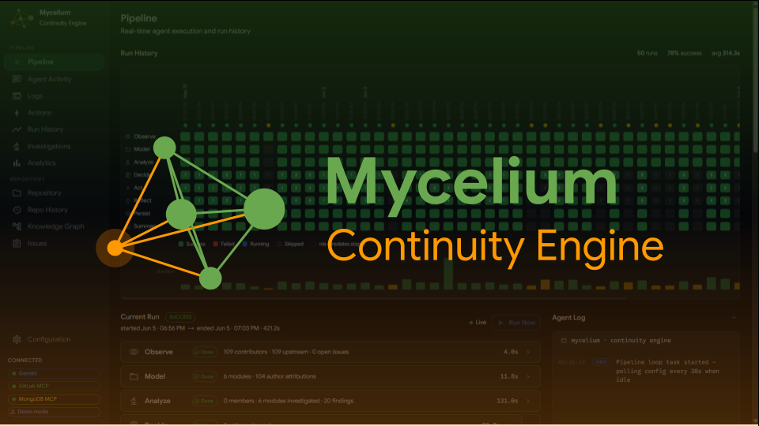

# Mycelium: Continuity Engine



[](LICENSE)
[](https://devpost.com/software/mycelium-x4myeu)

Mycelium is an autonomous agent system that prevents engineering knowledge loss as teams and codebases evolve. It infers who understands what in a codebase, where knowledge is fragile, and acts directly inside GitLab to stabilize it.

Built for the **Google Cloud Rapid Agent Hackathon 2026** using Vertex AI, ADK, Gemini, GitLab MCP, and MongoDB MCP. Runs an 8-stage autonomous pipeline: Observe → Model → Analyze → Decide → Act → Reflect → Persist → Summary.

---

## Docs

| Document | Description |
|---|---|
| [docs/SETUP.md](docs/SETUP.md) | Prerequisites, environment config, local run, webhooks, and deployment |
| [docs/ABOUT.md](docs/ABOUT.md) | Project writeup: inspiration, design, challenges, and roadmap |
| [docs/PROJECT_INFO.md](docs/PROJECT_INFO.md) | Full project overview: design decisions, pipeline stages, agent architecture, and roadmap |
| [docs/HACKATHON.md](docs/HACKATHON.md) | Hackathon compliance requirements and partner integration notes |

---

## Repository layout

```
mycelium/
├── docs/                   # Project documentation
│   ├── SETUP.md            # Setup guide: local run, environment, deployment
│   ├── ABOUT.md            # Project writeup: inspiration, design, challenges, roadmap
│   ├── PROJECT_INFO.md     # Full design and architecture reference
│   ├── HACKATHON.md        # Hackathon compliance requirements
│   └── draw.io/            # Architecture diagrams
├── mycelium/               # Backend: FastAPI + ADK pipeline agents
├── mycelium-ui/            # Frontend: Next.js monitoring UI
├── deploy.py               # Cloud Run deployment helper
└── LICENSE                 # Apache 2.0
```

### Backend: [`mycelium/`](mycelium/)

FastAPI service hosting the 9-stage pipeline, ADK agents, MCP connectors, and MongoDB knowledge graph driver.

### Frontend: [`mycelium-ui/`](mycelium-ui/)

Next.js dashboard for live pipeline monitoring, agent activity, knowledge graph visualization, and configuration.

### Deployment: [`deploy.py`](deploy.py)

Cloud Run deployment script for both the backend API and the UI.
